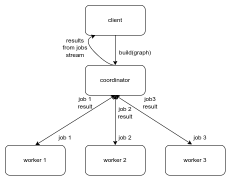

# Distbuild

This is a distributed build system. It consist of 3 types of services: 
`client`, `coordinator` and `worker`. The `client` issues build request to 
the `coordinator` by passing the build graph. The `coordinator` is responsible for streaming build results 
back to the `client` as well as coordinating build by sending build tasks to `workers`. 
A `worker` processes jobs from the `coordinator` and sends results back to 
it. Here's a diagram for better understanding:

Given enough `workers`, the `coordinator` ensures that all jobs in the 
build graph, that can be executed in parallel at any given time,
will be executed in parallel.

## Usage

The build system functionality is provided by 3 packages:

1. pkg/client - `client`
2. pkg/api - `coordinator`
3. pkg/worker - `worker`

For examples, see unit tests and integration tests in `disttest`.
